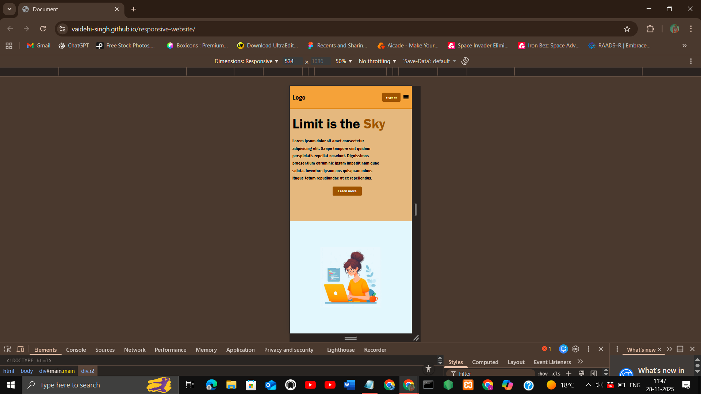
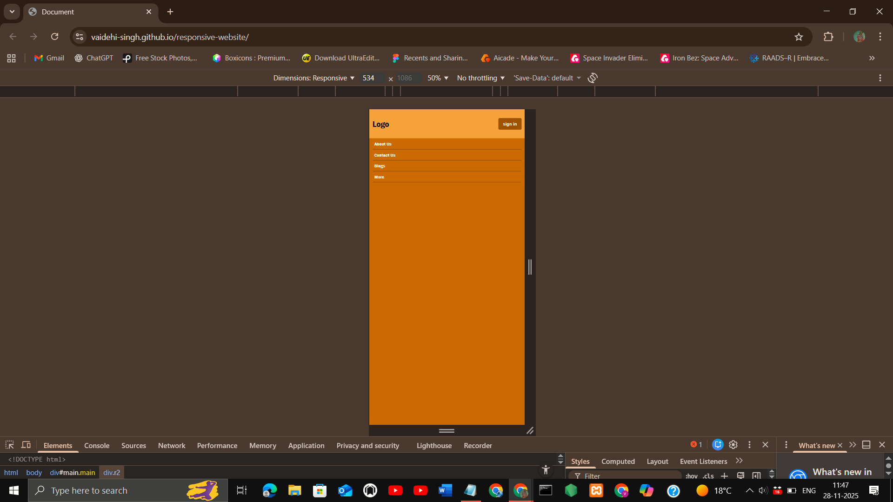

## Project Title
Responsive Website

## Description
A responsive website using HTML, CSS, and JavaScript. It features smooth transitions, clean layouts, and adapts seamlessly across mobile, tablet, and desktop devices, ensuring a modern, user‑friendly experience with professional styling and accessibility.

## Features
- Responsive design (mobile, tablet, desktop)
- Smooth transitions and animations
- Clean, modern UI
- Designed and built by me

## Demo
[Live Demo](https://vaidehi-singh.github.io/responsive-website/)

## Screenshots




## Tech Stack
- HTML
- CSS
- JavaScript

## How to Use
 1. Clone the repo  
   ```bash
   git clone https://github.com/vaidehi-singh/responsive-website.git
   cd responsive-website
   ```
 2. Open index.html in your browser.

## Author
Designed and developed by **Vaidehi Singh**  
[GitHub Profile](https://github.com/vaidehi-singh)
